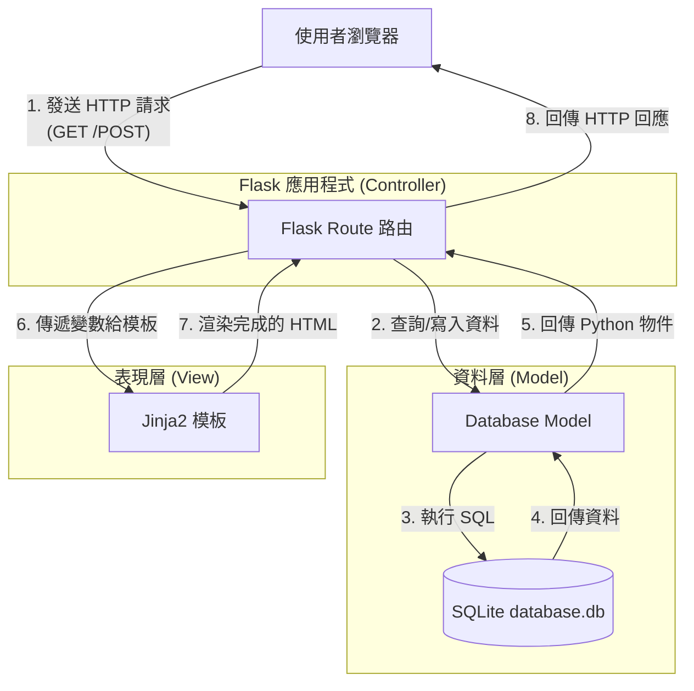

# 任務管理系統 - 系統架構設計

這份文件根據 PRD 需求，說明本專案的技術架構、資料夾結構與系統元件關係，確保開發過程中有清晰的藍圖可依循。

## 1. 技術架構說明

本專案採用經典的 Web 伺服器端渲染 (SSR) 架構，由後端直接將資料嵌入 HTML 頁面並回傳給瀏覽器。不採用前後端分離，以保持專案結構單純、易於維護。

- **後端框架**：Python + Flask
  - 輕量級，非常適合此類小型的任務管理系統。
- **模板引擎**：Jinja2
  - 整合於 Flask 之中，負責將後端取得的資料動態渲染成 HTML 頁面回傳給使用者。
- **資料庫**：SQLite
  - 以檔案為基礎的關聯式資料庫，無需額外安裝與設定資料庫伺服器，適合個人使用與開發階段。
- **架構模式**：類 MVC 模式 (Model-View-Controller)
  - **Model (資料模型)**：負責與資料庫溝通、定義任務的資料結構 (Task)。
  - **View (視圖)**：Jinja2 模板與前端靜態資源，負責畫面呈現。
  - **Controller (控制器)**：Flask 的 Route 函式，負責接收請求、呼叫 Model 取資料，最後把資料丟給 View 渲染。

## 2. 專案資料夾結構

專案將採用以下模組化的結構，將不同職責的程式碼分開：

```text
web_app_development2/
├── app/                      # 應用程式主要資料夾
│   ├── models/               # 資料庫模型與存取邏輯 (Model)
│   │   └── task.py           # 任務相關的資料表定義
│   ├── routes/               # 處理請求與路由 (Controller)
│   │   └── task_routes.py    # 任務的 CRUD 與搜尋、過濾路由
│   ├── templates/            # HTML 模板檔案 (View)
│   │   ├── base.html         # 共用的版型 (Header, Footer, CSS/JS 引入)
│   │   ├── index.html        # 首頁與任務列表
│   │   ├── task_form.html    # 新增與編輯任務的表單頁面
│   │   └── stats.html        # 進度統計圖表頁面
│   ├── static/               # 靜態資源檔案
│   │   ├── css/              # 樣式檔 (如 style.css)
│   │   └── js/               # 前端腳本 (處理表單驗證、圖表繪製)
│   └── __init__.py           # 初始化 Flask 應用程式與設定
├── instance/                 # 存放不進版控的執行時期檔案
│   └── database.db           # SQLite 資料庫檔案
├── docs/                     # 專案文件
│   ├── PRD.md                # 產品需求文件
│   └── ARCHITECTURE.md       # 系統架構文件 (本文)
├── requirements.txt          # Python 依賴套件清單
└── app.py                    # 專案啟動入口
```

## 3. 元件關係圖

以下展示使用者操作系統時，資料與請求的流向：



## 4. 關鍵設計決策

1. **模組化路由 (Blueprints)**
   - **決策**：在 `app/routes/` 裡面使用 Flask Blueprint 來管理路由，而不是把所有 `@app.route` 都塞在同一個檔案。
   - **原因**：雖然初期只有任務管理，但若未來要增加「使用者帳號」或「設定」功能，可以讓程式碼較好維護。
2. **共用基礎模板 (Template Inheritance)**
   - **決策**：在 `app/templates/` 中建立一個 `base.html`，並利用 Jinja2 的 `` 功能讓其他頁面繼承。
   - **原因**：確保每一頁的導覽列 (Navbar)、CSS 與 JS 的載入邏輯一致，不用重複寫 HTML 骨架。
3. **資料庫存取方式**
   - **決策**：預計採用 `sqlite3` 原生模組，或輕量化的封裝方式。
   - **原因**：需求單純（只有單一任務表），原生 SQL 可以輕易處理複雜查詢（如關鍵字與標籤過濾），不強求一定要引入龐大的 SQLAlchemy ORM，能加快開發速度並降低學習成本。
4. **前端圖表渲染**
   - **決策**：進度統計將使用輕量的前端圖表庫（如 Chart.js），搭配從 Flask 取得的資料來渲染。
   - **原因**：不讓後端負責產生圖片，減少伺服器運算負擔，也能提供更好的互動視覺體驗。
