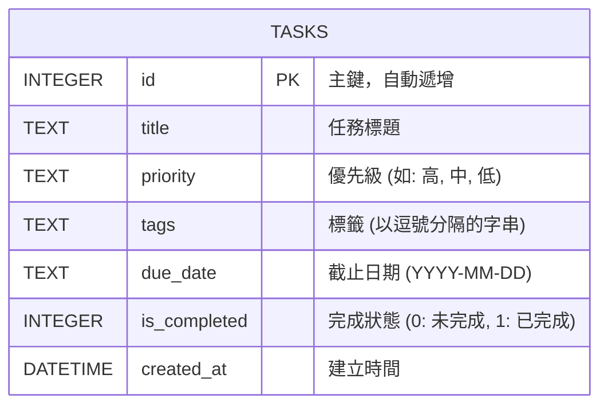

# 任務管理系統 - 資料庫設計

這份文件根據 PRD 需求與系統架構，定義系統所需的 SQLite 資料表結構與關聯。

## 1. ER 圖（實體關係圖）

本專案將任務的核心資訊與標籤合併在單一 `tasks` 資料表內處理，以求輕量化與快速開發（MVP 階段）。

## 2. 資料表詳細說明

### `tasks` 資料表

儲存所有任務的詳細資訊。

| 欄位名稱 | 型別 | 必填 | 預設值 | 說明 |
| :--- | :--- | :--- | :--- | :--- |
| `id` | INTEGER | 是 | (Auto) | Primary Key，自動遞增的任務唯一識別碼。 |
| `title` | TEXT | 是 | 無 | 任務的名稱或主旨。 |
| `priority` | TEXT | 否 | '中' | 任務優先級，可為 '高', '中', '低'。 |
| `tags` | TEXT | 否 | '' | 任務的分類標籤，若有多個則以逗號 `,` 分隔。 |
| `due_date` | TEXT | 否 | NULL | 截止日期，採 ISO 格式 (YYYY-MM-DD)。 |
| `is_completed` | INTEGER | 是 | 0 | 記錄任務是否完成 (0 為否，1 為是)。 |
| `created_at` | DATETIME | 是 | CURRENT_TIMESTAMP | 任務建立的時間點。 |

## 3. SQL 建表語法

請參考專案中的 `database/schema.sql`。

## 4. Python Model 程式碼

我們使用 Python 內建的 `sqlite3` 模組來撰寫 Model。
請參考 `app/models/task.py` 中的 `TaskModel` 類別，該類別封裝了：
- `create_table()`: 確保資料表存在
- `create_task()`: 新增任務
- `get_all_tasks()`: 取得所有任務 (支援關鍵字、狀態等過濾)
- `get_task_by_id()`: 依 ID 查詢單一任務
- `update_task()`: 更新任務資訊
- `toggle_complete()`: 切換任務完成狀態
- `delete_task()`: 刪除特定任務
