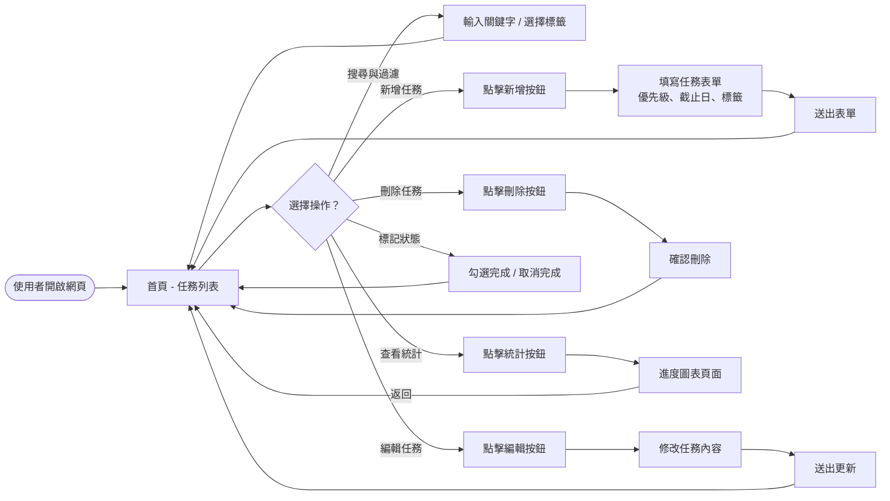
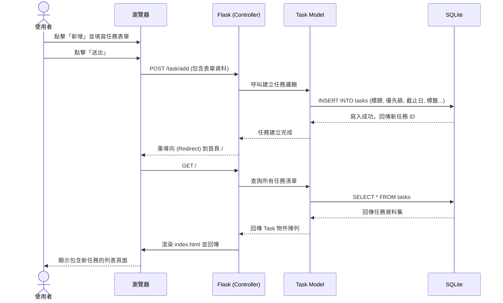

# 任務管理系統 - 流程圖與路徑對照

這份文件展示了任務管理系統的使用者操作流程、核心功能的系統序列圖，以及功能與 URL 路由的對照表，藉此梳理前端與後端的互動關係。

## 1. 使用者流程圖（User Flow）

以下圖表描述了使用者進入網站後，可以進行的各種操作路徑，涵蓋任務的 CRUD、狀態標記與統計查看等功能。

## 2. 系統序列圖（Sequence Diagram）

此序列圖展示了「使用者新增任務」時，瀏覽器、Flask 應用程式與資料庫之間的完整互動流程。

## 3. 功能清單對照表

本表列出系統所有主要功能與對應的 HTTP 方法及 URL 路徑規劃。

| 功能名稱 | 說明 | HTTP 方法 | URL 路徑 |
| :--- | :--- | :--- | :--- |
| **首頁與任務列表** | 顯示所有任務，支援關鍵字搜尋與標籤過濾 | GET | `/` |
| **新增任務頁面** | 顯示填寫任務內容的表單 | GET | `/task/add` |
| **送出新增任務** | 接收表單資料，並存入資料庫 | POST | `/task/add` |
| **編輯任務頁面** | 顯示既有任務內容以供修改 | GET | `/task/<int:id>/edit` |
| **送出更新任務** | 接收修改後的資料，並更新資料庫 | POST | `/task/<int:id>/edit` |
| **刪除任務** | 將特定任務從資料庫移除 | POST | `/task/<int:id>/delete` |
| **切換完成狀態** | 將任務標記為完成或未完成 | POST | `/task/<int:id>/toggle` |
| **進度統計圖表** | 顯示任務完成進度等相關統計圖表 | GET | `/stats` |
